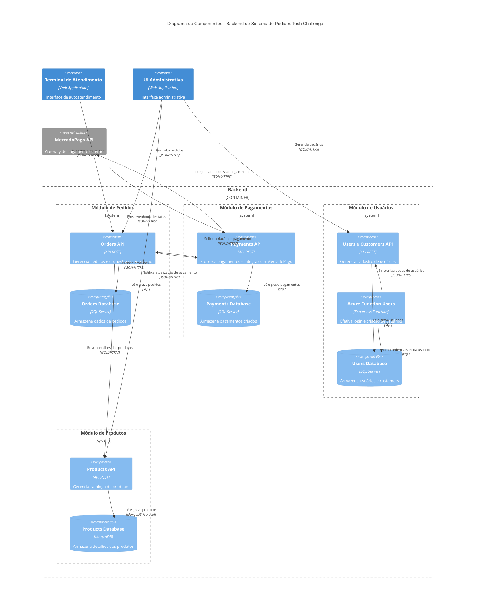

# documentations-grupo118-fase4

Repositório dedicado a conter diagramas C4 do sistema desenvolvido para a fase 4.

## Diagrama C4 - Contexto do Sistema - Sistema de Pedidos

## Diagrama C4 - Visão de Container - Sistema de Pedidos

## Diagrama C4 - Visão de Componentes - Backend do Sistema de Pedidos

