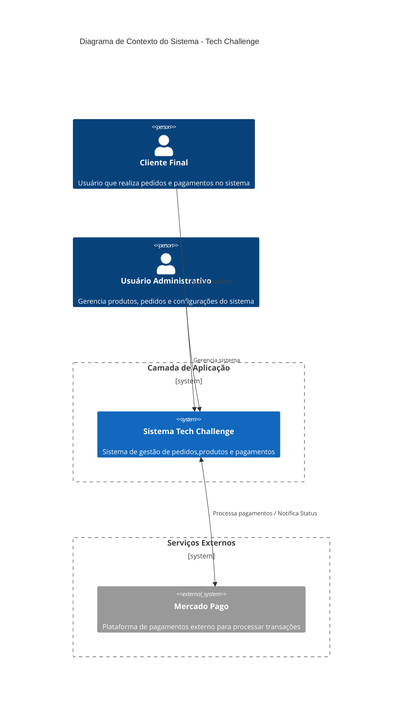
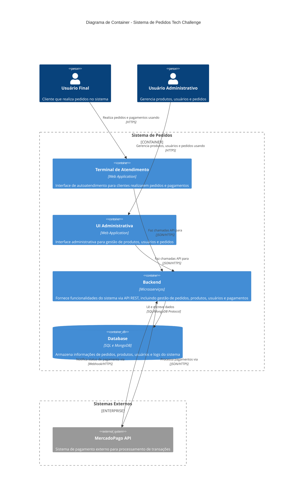
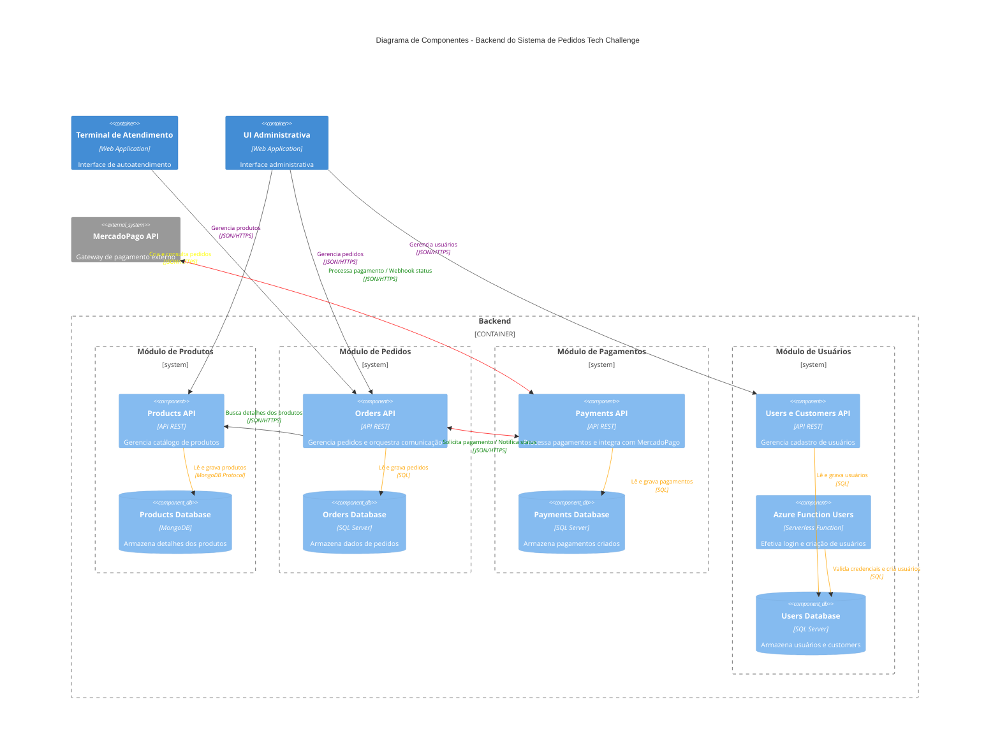

# documentations-grupo118-fase4
Criamos um repositório separado para armazenar diversos detalhes acerca da implementação do projeto na Fase 4

# Membros do Grupo
- Sabrina Cardoso de Oliveira
    - **Matrícula**: RM363507
    - **Usuário Discord**: sah.mdo
- Tiago Cristiano Koch
    - **Matrícula**: RM361415
    - **Usuário Discord**: tiagokoch0076
- Tiago Victor de Oliveira
    - **Matrícula**: RM364588
    - **Usuário Discord**: oliveirad.tiago
- Túlio Henrique de Paula Rezende
    - **Matrícula**: RM360982
    - **Usuário Discord**: tuliomamute
- Vinícius Rossmann Nunes
    - **Matrícula**: RM362963
    - **Usuário Discord**: _viniciusnunes

# Vídeo de Apresentação do Projeto

Para assistir ao vídeo de apresentação do projeto, clique na imagem abaixo:

[]()

# Separação da aplicação em microserviços
Dividimos a aplicação original em alguns microsserviços de maneira a paralelizarmos o desenvolvimento e facilitar a manutenção futura do sistema. 

Como parte da definição da atividade informava que a lanchonete era algo em crescimento ainda, preferimos utilizar um modelo de comunicação simples, baseado em requisições HTTP REST entre os microsserviços, evitando nesse primeiro momento uma complexidade adicional. Porém, em algums pontos da aplicação existe a possibilidade de ajustes futuros para utilização de modelo de eventos, como por exemplo:
- na comunicação entre o serviço de pedidos e pagamentos, onde a utilização de filas poderia trazer mais robustez ao sistema.
- na comunicaçação entre o serviço de pagamentos e pedidos, onde o serviço de pagamentos poderia publicar eventos de mudança de status de pagamento, e o serviço de pedidos poderia se inscrever nesses eventos para atualizar o status dos pedidos.

A seguir estão os microsserviços criados:

## 1. Módulo de Produtos

- Repositório: [tech-challenge-grupo-118-products-fase-4](https://github.com/Grupo-118-Tech-Challenge-Fiap-11SOAT/tech-challenge-grupo-118-products-fase-4)

- Abordagem da API: Clean Architecture


Criamos um microsserviço dedicado à gestão do catálogo de produtos.
Utilizamos **MongoDB** para armazenar os detalhes dos produtos, aproveitando sua flexibilidade para permitir que cada tipo de produto tenha atributos específicos, enriquecendo uma eventual visualização em um catalógo. Abaixo temos alguns exemplos de produtos inseridos em nossa base para demonstrar esse modelo flexível:

### Snack

```json
{
  "_id": {
    "$oid": "695ed9ec2a6b7bb7f043c025"
  },
  "_t": [
    "Product",
    "Snack"
  ],
  "name": "X-Salada",
  "price": {
    "$numberDecimal": "12"
  },
  "isActive": true,
  "images": [],
  "createdAt": {
    "DateTime": {
      "$date": "2026-01-07T22:10:52.095Z"
    },
    "Ticks": {
      "$numberLong": "639034206520956483"
    },
    "Offset": 0
  },
  "updatedAt": {
    "DateTime": {
      "$date": "2026-01-07T22:10:52.095Z"
    },
    "Ticks": {
      "$numberLong": "639034206520956718"
    },
    "Offset": 0
  },
  "ingredients": [
    "Pão",
    "Queijo",
    "Hamburgues"
  ]
}
```

### Drink

```json
{
  "_id": {
    "$oid": "695ed9ec2a6b7bb7f043c02c"
  },
  "_t": [
    "Product",
    "Drink"
  ],
  "name": "Pepsi",
  "price": {
    "$numberDecimal": "12"
  },
  "isActive": true,
  "images": [],
  "createdAt": {
    "DateTime": {
      "$date": "2026-01-07T22:10:52.099Z"
    },
    "Ticks": {
      "$numberLong": "639034206520991314"
    },
    "Offset": 0
  },
  "updatedAt": {
    "DateTime": {
      "$date": "2026-01-07T22:10:52.099Z"
    },
    "Ticks": {
      "$numberLong": "639034206520991316"
    },
    "Offset": 0
  },
  "size": "M",
  "flavor": null
}
```

## 2. Módulo de Pedidos

- Repositório: [tech-challenge-grupo-118-orders-fase-4](https://github.com/Grupo-118-Tech-Challenge-Fiap-11SOAT/tech-challenge-grupo-118-orders-fase-4)

- Abordagem da API: Hexagonal


Criamos um microsserviço dedicado à gestão de pedidos.
Utilizamos **SQL Server** para armazenar os dados dos pedidos, aproveitando a estrutura relacional para garantir a integridade dos dados e facilitar consultas, como por exemplo a visualização dos pedidos para monitoramento em telas para a ordem de entrega.

Iríamos em um primeiro momento, utilizar o banco PostgreSQL, porém por questões de infraestrutura (a impossibilidade de criação de um cluster na região East US, onde o nosso cluster AKS está hospedado) optamos por utilizar o SQL Server, que já estava disponível em nossa infraestrutura na Azure e já era o modelo utilizado no monolito.

## 3. Módulo de Pagamentos

- Repositório: [tech-challenge-grupo-118-payments-fase-4](https://github.com/Grupo-118-Tech-Challenge-Fiap-11SOAT/tech-challenge-grupo-118-payments-fase-4)

- Abordagem da API: Clean Architecture com Minimal APIs


Criamos um microsserviço dedicado ao processamento de pagamentos.
Utilizamos **SQL Server** para armazenar os dados dos pagamentos para manter a compatibilidade com a implementação anterior e ganharmos tempo durante o processo de desenvolvimento.

O módulo de pagamentos se comunica com a API do MercadoPago para processar as transações financeiras, informando a URL do webhook para receber notificações de status de pagamento.

## 4. Módulo de Usuários

- Repositórios: [tech-challenge-grupo-118-users-fase-4](https://github.com/Grupo-118-Tech-Challenge-Fiap-11SOAT/tech-challenge-grupo-118-users-fase-4) e [TechChallengeFastFoodFunction](https://github.com/Grupo-118-Tech-Challenge-Fiap-11SOAT/TechChallengeFastFoodFunction)

- Abordagem da API: Hexagonal


Criamos um microsserviço dedicado à gestão de usuários e aproveitamos a Lambda function criada na fase anterior para efetivar o login e geração do JWT para uso.
Também utilizamos **SQL Server** para armazenar os dados dos usuários e customers, mantendo a compatibilidade com a implementação anterior.

# Desenho da infraestrutura geral

No desenho abaixo ilustramos como é a estrutura dos recursos na Azure para suportar a aplicação.


- Cliente/usuário administrativo efetuam uma requisição
- Requisição chega no APIM
- APIM roteia, via NGINX Ingress Controller interno, para o serviço correto no cluster AKS
- Serviço no AKS se comunica com o banco de dados correspondente (MongoDB Atlas ou SQL Server na Azure)

# Processo de Deploy e infraestrutura como código

Para facilitar o deploy e garantir um processo padronizado entre os membros do grupo, criamos templates de pipeline de CI e CD utilizando Github Actions

- Repositório Template de Pipeline: [terraform-template-pipeline-grupo118-fase-3](https://github.com/Grupo-118-Tech-Challenge-Fiap-11SOAT/terraform-template-pipeline-grupo118-fase-3)
- Repositório Template de Helm Charts: [helm-chart-grupo118-fase-4](https://github.com/Grupo-118-Tech-Challenge-Fiap-11SOAT/helm-chart-grupo118-fase-4)
- Repositório do Terraform de Infra: [k8s-terraform-infra-grupo-118-fase-3](https://github.com/Grupo-118-Tech-Challenge-Fiap-11SOAT/k8s-terraform-infra-grupo-118-fase-3)
- Repositório do Terraform de Banco de Dados: [database-terraform-infra-grupo-118-fase-3](https://github.com/Grupo-118-Tech-Challenge-Fiap-11SOAT/database-terraform-infra-grupo-118-fase-3)

## Continous Integration
No processo de Continous Integration (CI), cada microsserviço possui um pipeline configurado no **Github Actions** que realiza as seguintes etapas:

### Durante o pull request
- Compilação do código: validação do build do projeto em um ambiente limpo
- Execução dos testes automatizados: executa todos os projetos de teste contidos na solução
- Análise de qualidade de código com SonarCloud: o template de pipeline cria automaticamente o projeto no SonarCloud caso ele não exista, utilizando as variáveis de ambiente configuradas no repositório
  - Caso o quality gate não atinja o percentual de 80%, é inserido no PR um comentário automático informando a falha na qualidade do código e o mesmo fica bloqueado para merge.
- Build da imagem Docker: Validação se o build em um contexto de container ocorre corretamente.

- Build e análise de código durante o pull request


- Build Docker - PR


### Na main
Além de todos os passos acima, na main o pipeline realiza também:
- Push da imagem Docker para o Container Registry: a imagem é enviada para o Azure Container Registry (ACR) para ser utilizada posteriormente no deploy.

- Build Docker - Main
  

## Continous Deployment e Helm Charts
Mantendo a mesma filosofia de padronização, criamos um helm chart que também é salvo no ACR para que todas as aplicações o utilizem. Esse Helm chart é responsável por:
- Criar a estrutura classica para funcionamento em Kubernetes (deployments, services, secrets)
- Criação do Ingress interno para comunicação via APIM
- Criação de Secret de ACR para permitir pull de imagens privadas

E para o deploy temos um pipeline padrão, também via Github Actions, que realiza as seguintes etapas:
- Mapeamento de Github secrets para variáveis de ambiente do pipeline
- Login no ACR
- Pull do Helm Chart
- Proceso de substituição de variáveis no Helm Chart
- Deploy via Helm no cluster AKS

Desse modo, a configuração das variaveis que cada aplicação utiliza ficou de maneira bem flexível

- Arquivo de pipeline de deploy de products como exemplo: [cd.yml](https://github.com/Grupo-118-Tech-Challenge-Fiap-11SOAT/tech-challenge-grupo-118-products-fase-4/blob/main/.github/workflows/cd.yml)
- Arquivo de Helm Chart de products utilizado como exemplo: [values-production.yaml](https://github.com/Grupo-118-Tech-Challenge-Fiap-11SOAT/tech-challenge-grupo-118-products-fase-4/blob/main/helm/values-production.yaml)

No momento do deploy, precisamos apenas informar qual a versão do Helm chart e qual a versão da imagem gera


Feito isso, o processo acontece de forma automática


## Terraform

Na parte de infraestrutura, reaproveitamos o repositório criado na fase 3 para manter a infraestrutura como código utilizando Terraform, visto que em termos de arquitetura de recursos, não tivemos mudanças.
Já na parte de banco de dados, também reaproveitamos o terraform de banco de dados, porém acrescentando os bancos de cada serviço e um módulo novo de MongoDB Atlas para o serviço de produtos.

Ambos os deploys foram realizados via Github Actions.

- Deploy da infraestrutura regular


- Deploy da infraestrutura de banco de dados


## Secrets
Todos os pipelines reaproveitam alguns secrets configurados no Github Actions para garantir a segurança das credenciais utilizadas durante o processo de CI/CD.
- Credenciais Azure
- Credenciais ACR
- Credenciais SonarCloud

Além disso, cada repositório de microsserviço possui seus próprios secrets para utilização no momento do deploy, como: 
- Strings de conexão com banco de dados
- Chaves de API do MercadoPago
- Configuração de JWT

# Configurações
Alguns passos, manuais até então, são necessários para o funcionamento correto do sistema:
1. Conexão no Kubernetes via kubectl port-foward para buscar o Swagger 
   - Como as APIs não são expostas publicamente, é preciso importar manualmente o Swagger para o APIM (efetuando o download do mesmo). Para isso, precisamos acessar as APIs via kubectl port-forward

Exemplo para o módulo de produtos:

```bash
kubectl port-forward svc/tech-challenge-grupo-118-products-fase-4 8080:80 -n tech-challenge
```

2. Importação do Swagger no APIM
   - Após baixar o Swagger via port-forward, é necessário importar o mesmo no APIM para que as APIs fiquem disponíveis para consumo
   - No portal do APIM, selecionar "APIs" e clicar em "+ Add API"
   - Selecionar "OpenAPI" e fazer o upload do arquivo Swagger baixado
   - Após o upload, configurar o "Web service URL" para o endpoint correto (exemplo: http://10.10.0.10/products-api)
     - é feito dessa maneira pois o Ingress configurado está pronto para substituir e enviar corretamente para as APIs, o path substituido.


3. Configuração no serviço de Pedidos da URL do APIM
  - Como enviamos a URL, no momento da criação do pagamento, para o MercadoPago, precisamos garantir que essa URL seja a do APIM e não a do serviço diretamente.
  - Essa URL é configurada via secrets do github no repositório de payments (secret: GS_MERCADOPAGO_NOTIFICATION_URL)

# Diagramas

Abaixo elaboramos alguns diagramas C4 para ilustrar a arquitetura do sistema.

## Diagrama C4 - Contexto do Sistema - Sistema de Pedidos



## Diagrama C4 - Visão de Container - Sistema de Pedidos




## Diagrama C4 - Visão de Componentes - Backend do Sistema de Pedidos

